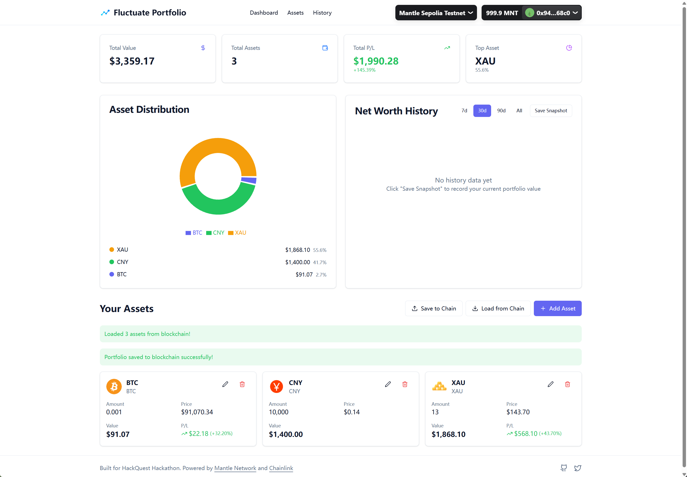

# Fluctuate Portfolio

<div align="center">

**波动资产实时记账仪表盘**

一个去中心化的个人资产管理网页应用，用户通过钱包连接即可管理比特币、黄金、外汇等多种波动资产  
实时估值、历史净值曲线查看，完全无需注册账号

[演示 Demo](https://fluctuate-portfolio.vercel.app) | [技术文档](./docs) | [视频介绍](https://www.bilibili.com/video/BV1NpiRBXEsy)

</div>

---

## 📖 项目简介

**Fluctuate Portfolio** 是为 **Mantle Global Hackathon 2025** 开发的去中心化资产管理仪表盘。

### 🎯 参赛赛道

- **主赛道**：AI & Oracles（核心使用 Chainlink 预言机实时获取价格数据）
- **次赛道**：Infrastructure & Tooling（用户资产监控仪表盘）
- **加分赛道**：RWA / RealFi（支持黄金等真实世界资产的代币化版本跟踪）

### 💡 核心价值

解决传统记账软件的三大痛点：
- ❌ 无法实时准确处理波动资产（比特币、黄金、汇率）估值
- ❌ 需要繁琐注册、担心数据隐私
- ❌ 跨设备同步不便

我们的解决方案：
- ✅ **钱包即账号**，连接即用
- ✅ 数据用户掌控，隐私安全
- ✅ 实时价格来自 **Chainlink 预言机**
- ✅ **Mantle 低 gas 费**，上链存储几乎免费

---

## ✨ 核心功能

| 功能 | 描述 |
|------|------|
| 🔐 **钱包连接** | 支持 MetaMask、WalletConnect，无需注册 |
| 📊 **多资产支持** | 加密货币、黄金白银、外汇、自定义资产 |
| 💰 **实时估值** | Chainlink 价格源，自动计算总净值和涨跌幅 |
| 📈 **历史曲线** | 净值变化可视化，支持 30/90 天视图 |
| 💾 **数据持久化** | 本地存储 / 链上存储（可选） |
| 🎨 **资产分布** | 饼图展示资产配置 |

> 📚 查看 [详细功能说明](./docs/features.md)

---

## 🛠️ 技术栈

### 前端
- **框架**：React + Vite + TypeScript
- **Web3**：wagmi + viem + RainbowKit
- **UI**：Tailwind CSS + Shadcn/ui
- **图表**：Recharts

### 智能合约
- **语言**：Solidity ^0.8.20
- **工具**：Foundry (Forge + Cast + Anvil)
- **网络**：Mantle Testnet / Mainnet
- **测试**：Solidity 原生测试 + Fuzz Testing

### 核心技术
- **预言机**：Chainlink Price Feeds
- **部署**：Vercel (前端) + Mantle (合约)

> 📚 查看 [技术架构文档](./docs/architecture.md)

---

## 🚀 快速开始

### 前置要求

- Node.js >= 18
- 支持 EVM 的钱包（MetaMask）

### 安装依赖

```bash
# 克隆仓库
git clone https://github.com/yourusername/fluctuate-portfolio.git
cd fluctuate-portfolio

# 安装依赖
npm install
```

### 环境配置

```bash
# 复制环境变量模板
cp .env.example .env

# 编辑 .env 文件，填入必要配置
# VITE_MANTLE_RPC_URL=
# VITE_CHAINLINK_FEEDS_ADDRESS=
```

### 运行开发服务器

```bash
npm run dev
```

访问 `http://localhost:5173` 查看应用

### 部署智能合约

```bash
cd foundry

# 构建合约
forge build

# 运行测试
forge test -vv

# 部署到 Mantle 测试网
forge script script/Deploy.s.sol:DeployFluctuatePortfolio \
    --rpc-url https://rpc.sepolia.mantle.xyz \
    --broadcast
```

> 📚 查看 [详细部署指南](./docs/deployment.md)

---

## 📂 项目结构

```
fluctuate-portfolio/
├── src/                      # 前端源代码
│   ├── components/          # React 组件
│   ├── hooks/               # 自定义 Hooks
│   ├── utils/               # 工具函数
│   └── App.tsx              # 主应用
├── foundry/                 # 智能合约 (Foundry)
│   ├── src/                 # 合约源码
│   │   └── FluctuatePortfolio.sol
│   ├── test/                # Solidity 测试
│   │   └── FluctuatePortfolio.t.sol
│   ├── script/              # 部署脚本
│   │   └── Deploy.s.sol
│   └── foundry.toml         # Foundry 配置
├── docs/                    # 项目文档
│   ├── features.md          # 功能说明
│   ├── architecture.md      # 技术架构
│   ├── contract.md          # 合约设计
│   ├── timeline.md          # 开发计划
│   └── submission.md        # 提交材料
└── README.md                # 项目说明
```

---

## 🎬 演示

### 在线 Demo
🔗 [https://fluctuate-portfolio.vercel.app](https://fluctuate-portfolio.vercel.app)

### 视频介绍
🎥 [观看演示视频](https://www.bilibili.com/video/BV1NpiRBXEsy)

### 功能截图



---

## 📝 开发计划

**项目周期**：14天（2025.12.30 - 2026.01.12）

- ✅ Day 1-2：项目初始化 + 钱包连接
- ⏳ Day 3-4：Chainlink 集成 + 实时估值
- ⏳ Day 5-6：资产管理 + 数据持久化
- ⏳ Day 7-8：智能合约 + 上链功能
- ⏳ Day 9：UI 优化 + 历史曲线
- ⏳ Day 10-12：测试 + 视频录制
- ⏳ Day 13-14：最终提交

> 📚 查看 [详细时间规划](./docs/timeline.md)

---

## 📄 文档

- [功能详细说明](./docs/features.md)
- [技术架构设计](./docs/architecture.md)
- [智能合约文档](./docs/contract.md)
- [前端代码规范](./docs/frontend.md)
- [开发时间规划](./docs/timeline.md)
- [提交材料清单](./docs/submission.md)

---

## 🤝 贡献

欢迎提交 Issue 和 Pull Request！

---

## 📧 联系方式

- GitHub: [@ranxi2001](https://github.com/ranxi2001)
- Twitter: [@Onefly](https://x.com/Onefly)
- Email: ranxi169@gmail.com

---

## 📜 License

MIT License

---

<div align="center">

**Built for HackQuest Hackathon** 🚀

Powered by Mantle Network and Chainlink

</div>